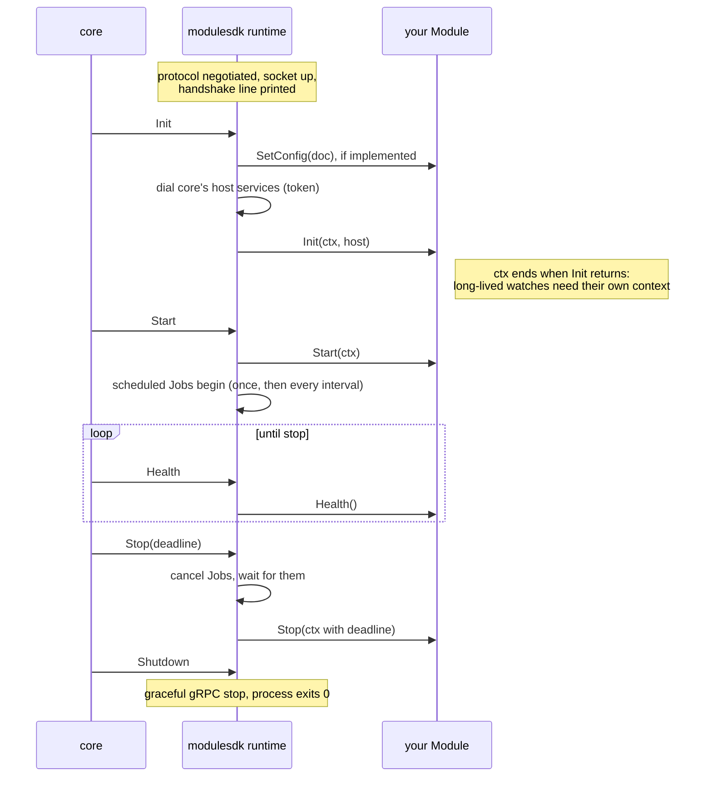

# Writing a module

A module is a separate binary that `weave-agent` (core) launches, verifies, supervises and
speaks gRPC to over a local socket. You implement one interface; this sdk handles everything
on the wire.

The rules come from core's
[spec §5](https://github.com/weaveplatform/weaveplatform-agent-core/blob/main/spec.md):
modules never import each other, never open their own sockets, never draw UI, and `Host` is
closed by default. A module that needs a new host method is an architecture decision in
core, not a pull request here.

There are two ways to build one:

- **A weave capability module** (everything under [`../../modules`](../../modules)): one
  capability on one OS, answering `weave.<capability>` requests from the host over the
  hypervisor channel. You write an OS backend; `weavemodule` and the capability's `Service`
  do the rest. Start here unless you are writing something that is not a capability.
- **A module on `modulesdk` directly**: anything else core should run. You implement
  `modulesdk.Module` yourself.

## A weave capability module

A capability module is a `main.go` and an OS backend:

```go
//go:build linux

package main

import (
	"github.com/weaveplatform/weaveplatform-agent-modules/sdk/modulesdk"
	"github.com/weaveplatform/weaveplatform-agent-modules/sdk/weavemodule"
	"github.com/weaveplatform/weaveplatform-agent-modules/sdk/weavetime"
	"github.com/weaveplatform/weaveplatform-agent-modules/sdk/weavewire"
)

func main() {
	modulesdk.Serve(weavemodule.New(
		weavemodule.ModuleID("linux", weavewire.Time), // weave-linux-time
		weavetime.NewService(newClock()),              // newClock is the OS backend
	))
}
```

Everything OS-neutral (decoding, policy, streaming, reply ordering) lives in the
capability's `sdk/weave<capability>` package, so the three OS variants differ only in the
backend they hand it. The wire contract (kinds and payloads) lives only in
[`weavewire`](../weavewire). Every file except `doc.go` carries the module's OS build tag.

The repository's conventions for a new one are in the root [`CLAUDE.md`](../../CLAUDE.md) and
[`docs/decisions/0001-capability-modules-per-os.md`](../../docs/decisions/0001-capability-modules-per-os.md).

## A module on modulesdk

```go
package main

import "github.com/weaveplatform/weaveplatform-agent-modules/sdk/modulesdk"

func main() { modulesdk.Serve(myproduct.New()) }
```

`Serve` reads the handshake environment core sets, negotiates the protocol (exiting with
code 78 if core's window excludes this sdk's protocol), listens on the module socket,
answers the one-line handshake, and dispatches core's lifecycle RPCs onto your
implementation:

```go
type Module interface {
    ID() string
    Requires() []Capability            // gates launch against the host probe
    Init(context.Context, Host) error  // wire up; declare surfaces; read policy
    Start(context.Context) error       // begin the module's work
    Stop(context.Context) error        // drain within the deadline
    Health() Health                    // healthy / degraded / unhealthy
}
```

Optionally implement `ConfigReceiver` (`SetConfig(doc []byte) error`) to receive the
core-delivered configuration document before `Init`, and `Scheduled` (`Jobs() []Job`) for
recurring work the runtime starts at Start and stops at Stop.

The runtime enforces the call order, so you never defend against Init-twice or
Start-before-Init:



### The Host

Everything a module needs from the platform comes through `Host`:

| Surface | What it is | Notes |
|---|---|---|
| `Store(ns)` | encrypted key/value, namespaced to your module | you can never reach another module's namespace |
| `Policy()` | read and watch your policy document | watch on a module-lifetime context, not Init's: Init's is cancelled the moment Init returns |
| `Events()` | publish/subscribe bus | topics arrive prefixed with the publisher's id, stamped by core; the only lateral channel between modules |
| `Transport()` | send and receive over core's authenticated host channel | `queueOffline: true` survives a disconnected host; see the peer below |
| `Identity()` | who the device is, and module-scoped credentials | you never see private keys |
| `UI().Declare(...)` | declare surfaces as data, during Init | the portal renders; modules never draw. After Init it returns `ErrSurfacesAfterInit` |
| `Log()` | `*slog.Logger` | streamed to core and attributed to your module |

Errors from host calls map onto `werror` sentinels (`ErrNotFound`, `ErrUnavailable`,
`ErrDenied`, `ErrProtocol`), so branch with `errors.Is` rather than on gRPC codes.

### The transport peer

`Transport()` addresses a peer, not a socket, and core owns the connection. There is one:
`PeerHypervisor`, the host channel to whatever drives the machine from directly outside it
(the hypervisor tooling inside a VM, the container runtime inside a container). Declare the
`hypervisor.channel` capability to require it; core will not launch your module on a host
without one.

Messages from several modules share that one connection. A module that streams should chunk
rather than send one enormous message, and inbound delivery is fire-and-forget: correlate a
reply by carrying your own id in the payload. [`weaveagent`](../weaveagent) and
[`weavewire`](../weavewire) are a worked example of both.

On the channel a module answers to its manifest `address`, or its `id` when it sets none.
Builds of one capability for different guest operating systems share one address
(`weave.exec` for `weave-linux-exec`, `weave-macos-exec` and `weave-windows-exec`), so the
host reaches them without knowing the guest OS. Core refuses to register a second module
under an address already taken.

### Health is a vocabulary, not a boolean

Report `HealthDegraded` with a reason when a backend you need is temporarily absent (no
display session yet, device unplugged): the supervisor restarts `HealthUnhealthy` modules,
not degraded ones. Failing `Init` because a backend is missing turns a recoverable condition
into a crash loop.

## The manifest

Every module ships a `module.manifest.json` beside its binary: id, version, protocol, zone,
privilege, session placement, platforms, capabilities, address and signing identity. Core
gates launch on it and verifies the binary before every exec. The schema is core's
[`module-manifest.schema.json`](https://github.com/weaveplatform/weaveplatform-agent-core/blob/main/schema/module-manifest.schema.json);
[`protocol/manifest`](../protocol/manifest) has the Go types and the same validation.

Declare the least privilege that works (`service`, not `system`), and declare per-user
session placement rather than discovering at runtime that session 0 has its own clipboard.

## Testing

Three levels, from fastest to most real:

1. **In process.** `weavemodule/weavemoduletest` gives a capability module a fake host and
   transport; `testkit.NewHostData()` backs the in-memory host services for a plain
   `modulesdk` module. Unit-test the module's logic without processes.
2. **Your built binary under `testkit.StubCore`.** It spawns the binary, performs the real
   core-side handshake, and drives Init, Start, Health and Shutdown. Its `HostData` records
   every store write, event and transport send, so integration tests assert real behaviour:

   ```go
   core := &testkit.StubCore{ModuleID: "weave-linux-time"}
   proc, err := core.Launch(ctx, binPath) // ErrProtocolRefused on a clean window refusal
   resp, err := core.Init(ctx, proc)
   ```

3. **Under the released `weave-agent`.** The quality gate's `compat` job does this for
   [`internal/compatfixture`](../internal/compatfixture) on Linux, macOS and Windows; run it
   locally with `make compat AGENT_DIR=<extracted release archive>`. Release builds of core
   verify every module before exec, so the test signs a channel manifest naming the
   fixture's SHA-256 with core's own `weavemanifest`, and starts core with `--channel-dir`
   and `--manifest-root-pub`: the offline-install verification path, which is the same on
   every OS and needs no platform code-signing identity. This is the
   `terraform-plugin-testing` model: the real binary, driven through its own interface.

Two conventions for CI: append `.exe` to test-built binaries on Windows, and keep temporary
directories short when unix sockets are involved (macOS limits a socket path to 104 bytes).
